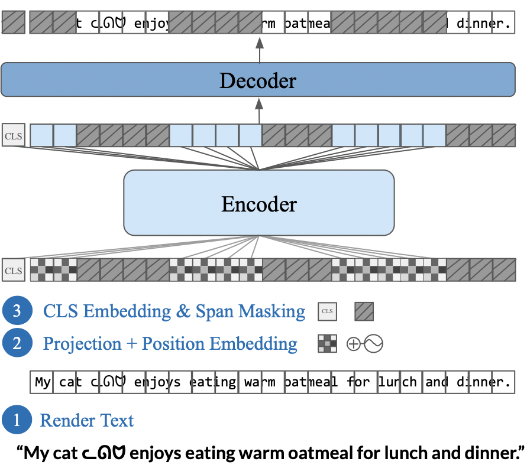
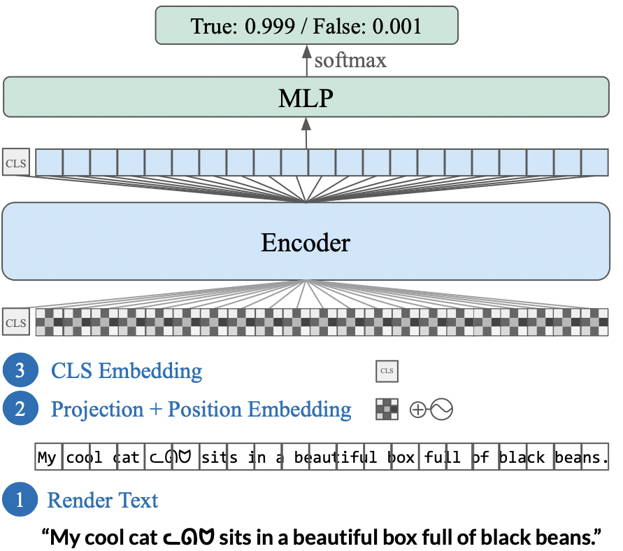

# PIXEL

This repository contains code for **PIXEL**, the **Pix**el-based **E**ncoder of **L**anguage. PIXEL is a language model that operates on text rendered as images, fully removing the need for a fixed vocabulary. This effectively allows for transfer to any language and script that can be typeset on your computer screen.

We pretrained a monolingual PIXEL model on the English Wikipedia and BookCorpus (in total around 3.2B words), the same data as BERT, and showed that PIXEL substantially outperforms BERT on syntactic and semantic processing tasks on scripts that are not found in the pretraining data, but PIXEL is slightly weaker than BERT when working with Latin scripts.

For details about PIXEL, please have a look at our paper [Language Modelling with Pixels](https://arxiv.org/abs/2207.06991). Information on how to cite our work can be found at the bottom.

<p align="middle">
  
  
  
</p>

PIXEL consists of three major components: a text renderer, which draws text as an image; an encoder, which encodes the unmasked regions of the rendered image; and a decoder, which reconstructs the masked regions at the pixel level. It is built on [ViT-MAE](https://arxiv.org/abs/2111.06377).

During pretraining, the renderer produces images containing the training sentences. Patches of these images are linearly projected to obtain patch embeddings (as opposed to having an embedding matrix like e.g. in BERT), and 25% of the patches are masked out. The encoder, which is a Vision Transformer (ViT), then only processes the unmasked patches. The lightweight decoder with hidden size 512 and 8 transformer layers inserts learnable mask tokens into the encoder's output sequence and learns to reconstruct the raw pixel values at the masked positions.

After pretraining, the decoder can be discarded leaving an 86M parameter encoder, upon which task-specific classification heads can be stacked. Alternatively, the decoder can be retained and PIXEL can be used as a pixel-level generative language model (see Figures 3 and 6 in the paper for examples).

## Demo
Check out our Gradio demo for text reconstruction with PIXEL at [https://huggingface.co/spaces/Team-PIXEL/PIXEL](https://huggingface.co/spaces/Team-PIXEL/PIXEL)!

## Coming Soon
- Rendering guide
- Finetuned robustness models
- Integration into HuggingFace transformers

## Setup

This codebase is built on [Transformers](https://github.com/huggingface/transformers) for PyTorch. We also took inspiration from the original [ViT-MAE codebase](https://github.com/facebookresearch/mae). The default font `GoNotoCurrent.ttf` that we used for all experiments is a merged Noto font built with [go-noto-universal](https://github.com/satbyy/go-noto-universal).

You can set up this codebase as follows to get started with using PIXEL models:

<details>
  <summary><i>Show Instructions</i></summary>
&nbsp;

1. Clone repo and initialize submodules
```
git clone https://github.com/xplip/pixel.git
cd pixel
git submodule update --init --recursive
```

2. Create a fresh conda environment
```
conda create -n pixel-env python=3.9
conda activate pixel-env
```

3. Install Python packages
```bash
conda install pytorch torchvision cudatoolkit=11.3 -c pytorch
conda install -c conda-forge pycairo pygobject manimpango
pip install --upgrade pip
pip install -r requirements.txt
pip install ./datasets
pip install -e .
```

4. (Optional) Install Nvidia Apex
```bash
git clone https://github.com/NVIDIA/apex
cd apex
pip install -v --disable-pip-version-check --no-cache-dir --global-option="--cpp_ext" --global-option="--cuda_ext" ./
```

</details>

## Pretraining PIXEL

We provide instructions for pretraining PIXEL in [PRETRAINING.md](.github/PRETRAINING.md).

You can find our pretrained PIXEL-base at [https://huggingface.co/Team-PIXEL/pixel-base](https://huggingface.co/Team-PIXEL/pixel-base).

**Note**: This link also gives access to all intermediate training checkpoints from 10k to 1M steps through the commit history. You can select these checkpoints when finetuning PIXEL via `--model_revision=<commit_id>`

Our pretraining datasets are also on the HuggingFace hub and can be loaded via the [datasets](https://github.com/huggingface/datasets) library:
- [Team-PIXEL/rendered-bookcorpus](https://huggingface.co/datasets/Team-PIXEL/rendered-bookcorpus)
- [Team-PIXEL/rendered-wikipedia-english](https://huggingface.co/datasets/Team-PIXEL/rendered-wikipedia-english)

## Finetuning PIXEL

We provide instructions for finetuning PIXEL in [FINETUNING.md](.github/FINETUNING.md). If you follow our training recipes or simply evaluate using the models we provide via the links below, you can expect similar results as below.

**Note**: The links give access to all 5 random seeds that we averaged results over for each model (one in the main branch, and the others in branches seed2–seed5). You can select different seeds via `--model_revision=<branch_name>`.


#### Universal Dependencies (POS Tagging and Dependency Parsing)

<details>
  <summary><i>Show Table</i></summary>
&nbsp;


|                                   	|                                             English-EWT                                            	|                                             Arabic-PADT                                            	|                                             Coptic-Scriptorium                                            	|                                             Hindi-HDTB                                            	|                                             Japanese-GSD                                            	|                                             Korean-GSD                                            	|                                           Tamil-TTB                                           	|                                             Vietnamese-VTB                                            	|                                             Chinese-GSD                                            	|
|-----------------------------------	|:--------------------------------------------------------------------------------------------------:	|:--------------------------------------------------------------------------------------------------:	|:---------------------------------------------------------------------------------------------------------:	|:-------------------------------------------------------------------------------------------------:	|:---------------------------------------------------------------------------------------------------:	|:-------------------------------------------------------------------------------------------------:	|:---------------------------------------------------------------------------------------------:	|:-----------------------------------------------------------------------------------------------------:	|:--------------------------------------------------------------------------------------------------:	|
| **POS Tagging**<br />*Accuracy*   	|   96.7<br /> [Models](https://huggingface.co/Team-PIXEL/pixel-base-finetuned-pos-ud-english-ewt)   	|   95.7<br /> [Models](https://huggingface.co/Team-PIXEL/pixel-base-finetuned-pos-ud-arabic-padt)   	|   96.0<br /> [Models](https://huggingface.co/Team-PIXEL/pixel-base-finetuned-pos-ud-coptic-scriptorium)   	|   96.3<br /> [Models](https://huggingface.co/Team-PIXEL/pixel-base-finetuned-pos-ud-hindi-hdtb)   	|   97.2<br /> [Models](https://huggingface.co/Team-PIXEL/pixel-base-finetuned-pos-ud-japanese-gsd)   	|   94.2<br /> [Models](https://huggingface.co/Team-PIXEL/pixel-base-finetuned-pos-ud-korean-gsd)   	|  81.0<br /> [Models](https://huggingface.co/Team-PIXEL/pixel-base-finetuned-pos-ud-tamil-ttb) 	|   85.7<br /> [Models](https://huggingface.co/Team-PIXEL/pixel-base-finetuned-pos-ud-vietnamese-vtb)   	|   92.8<br /> [Models](https://huggingface.co/Team-PIXEL/pixel-base-finetuned-pos-ud-chinese-gsd)   	|
| **Dependency Parsing**<br />*LAS* 	| 88.7<br /> [Models](https://huggingface.co/Team-PIXEL/pixel-base-finetuned-parsing-ud-english-ewt) 	| 77.3<br /> [Models](https://huggingface.co/Team-PIXEL/pixel-base-finetuned-parsing-ud-arabic-padt) 	| 83.5<br /> [Models](https://huggingface.co/Team-PIXEL/pixel-base-finetuned-parsing-ud-coptic-scriptorium) 	| 89.2<br /> [Models](https://huggingface.co/Team-PIXEL/pixel-base-finetuned-parsing-ud-hindi-hdtb) 	| 90.7<br /> [Models](https://huggingface.co/Team-PIXEL/pixel-base-finetuned-parsing-ud-japanese-gsd) 	| 78.5<br /> [Models](https://huggingface.co/Team-PIXEL/pixel-base-finetuned-parsing-ud-korean-gsd) 	| 52.6<br /> [Models](https://huggingface.co/Team-PIXEL/pixel-base-finetuned-parsing-tamil-ttb) 	| 50.5<br /> [Models](https://huggingface.co/Team-PIXEL/pixel-base-finetuned-parsing-ud-vietnamese-vtb) 	| 73.7<br /> [Models](https://huggingface.co/Team-PIXEL/pixel-base-finetuned-parsing-ud-chinese-gsd) 	|

</details>

#### MasakhaNER

<details>
  <summary><i>Show Table</i></summary>
&nbsp;

|            	|                                 ConLL-2003</br> English                                 	|                                          Amharic                                          	|                                           Hausa                                           	|                                            Igbo                                           	|                                        Kinyarwanda                                        	|                                          Luganda                                          	|                                            Luo                                            	|                                     Naija </br> Pidgin                                    	|                                          Swahili                                          	|                                           Wolof                                           	|                                           Yorùbá                                          	|
|------------	|:---------------------------------------------------------------------------------------:	|:-----------------------------------------------------------------------------------------:	|:-----------------------------------------------------------------------------------------:	|:-----------------------------------------------------------------------------------------:	|:-----------------------------------------------------------------------------------------:	|:-----------------------------------------------------------------------------------------:	|:-----------------------------------------------------------------------------------------:	|:-----------------------------------------------------------------------------------------:	|:-----------------------------------------------------------------------------------------:	|:-----------------------------------------------------------------------------------------:	|:-----------------------------------------------------------------------------------------:	|
| *F1 Score* 	| 89.5</br> [Models](https://huggingface.co/Team-PIXEL/pixel-base-finetuned-conll2003-en) 	| 47.7</br> [Models](https://huggingface.co/Team-PIXEL/pixel-base-finetuned-masakhaner-amh) 	| 82.4</br> [Models](https://huggingface.co/Team-PIXEL/pixel-base-finetuned-masakhaner-hau) 	| 79.9</br> [Models](https://huggingface.co/Team-PIXEL/pixel-base-finetuned-masakhaner-ibo) 	| 64.2</br> [Models](https://huggingface.co/Team-PIXEL/pixel-base-finetuned-masakhaner-kin) 	| 76.5</br> [Models](https://huggingface.co/Team-PIXEL/pixel-base-finetuned-masakhaner-lug) 	| 66.6</br> [Models](https://huggingface.co/Team-PIXEL/pixel-base-finetuned-masakhaner-luo) 	| 78.7</br> [Models](https://huggingface.co/Team-PIXEL/pixel-base-finetuned-masakhaner-pcm) 	| 79.8</br> [Models](https://huggingface.co/Team-PIXEL/pixel-base-finetuned-masakhaner-swa) 	| 59.7</br> [Models](https://huggingface.co/Team-PIXEL/pixel-base-finetuned-masakhaner-wol) 	| 70.7</br> [Models](https://huggingface.co/Team-PIXEL/pixel-base-finetuned-masakhaner-yor) 	|

</details>

#### GLUE Validation Sets

<details>
  <summary><i>Show Table</i></summary>
&nbsp;

|                                  MNLI-M/MM</br> *Acc*                                  	|                                  QQP</br> *F1*                                 	|                                 QNLI</br> *Acc*                                 	|                                 SST-2</br> *Acc*                                	|                           COLA</br> *Matthew's Corr.*                           	|                            STS-B</br> *Spearman's ρ*                            	|                                  MRPC</br> *F1*                                 	|                                 RTE</br> *Acc*                                 	|                                 WNLI</br> *Acc*                                 	|    Avg    	|
|:--------------------------------------------------------------------------------------:	|:------------------------------------------------------------------------------:	|:-------------------------------------------------------------------------------:	|:-------------------------------------------------------------------------------:	|:-------------------------------------------------------------------------------:	|:-------------------------------------------------------------------------------:	|:-------------------------------------------------------------------------------:	|:------------------------------------------------------------------------------:	|:-------------------------------------------------------------------------------:	|:---------:	|
| 78.1 / 78.9</br> [Models](https://huggingface.co/Team-PIXEL/pixel-base-finetuned-mnli) 	| 84.5</br> [Models](https://huggingface.co/Team-PIXEL/pixel-base-finetuned-qqp) 	| 87.8</br> [Models](https://huggingface.co/Team-PIXEL/pixel-base-finetuned-qnli) 	| 89.6</br> [Models](https://huggingface.co/Team-PIXEL/pixel-base-finetuned-sst2) 	| 38.4</br> [Models](https://huggingface.co/Team-PIXEL/pixel-base-finetuned-cola) 	| 81.1</br> [Models](https://huggingface.co/Team-PIXEL/pixel-base-finetuned-stsb) 	| 88.2</br> [Models](https://huggingface.co/Team-PIXEL/pixel-base-finetuned-mrpc) 	| 60.5</br> [Models](https://huggingface.co/Team-PIXEL/pixel-base-finetuned-rte) 	| 53.8</br> [Models](https://huggingface.co/Team-PIXEL/pixel-base-finetuned-wnli) 	| 74.1</br> 	|

</details>

#### Question Answering (TyDiQA-GoldP, SQuAD, KorQuAD 1.0, JaQuAD)

<details>
  <summary><i>Show Table</i></summary>
&nbsp;
Notes:

1) To obtain per-language predictions and scores for TyDiQA-GoldP, follow the instructions from [https://github.com/google-research-datasets/tydiqa/tree/master/gold_passage_baseline](https://github.com/google-research-datasets/tydiqa/tree/master/gold_passage_baseline)
2) To reproduce our scores for KorQuAD, use the official KorQuAD evaluation script available [here](https://korquad.github.io/KorQuad%201.0/)

<table>
<thead>
  <tr>
    <th rowspan="2"</th>
    <th colspan="10">TyDiQA-GoldP</th>
    <th>SQuADv1</br></th>
    <th>KorQuADv1<br></th>
    <th>JaQuAD<br></th>
  </tr>
  <tr>
    <td>English</td>
    <td>Arabic</td>
    <td>Bengali</td>
    <td>Finnish</td>
    <td>Indonesian</td>
    <td>Korean</td>
    <td>Russian</td>
    <td>Swahili</td>
    <td>Telugu</td>
    <td>Avg</td>
    <td>English</td>
    <td>Korean</td>
    <td>Japanese</td>
  </tr>
</thead>
<tbody>
  <tr>
    <td><i>F1 Score</i></td>
    <td>59.6</td>
    <td>57.3</td>
    <td>36.3</td>
    <td>57.1</td>
    <td>63.6</td>
    <td>26.1</td>
    <td>50.5</td>
    <td>65.9</td>
    <td>61.7</td>
    <td>52.3</td>
    <td>81.4</td>
    <td>78.0</td>
    <td>34.1</td>

  </tr>
  <tr>
    <td>URL</td>
    <td colspan="10" align="center" ><a href="https://huggingface.co/Team-PIXEL/pixel-base-finetuned-tydiqa-goldp">Models</a></td>
    <td><a href="https://huggingface.co/Team-PIXEL/pixel-base-finetuned-squadv1">Models</a></td>
    <td><a href="https://huggingface.co/Team-PIXEL/pixel-base-finetuned-korquadv1">Models</a></td>
    <td><a href="https://huggingface.co/Team-PIXEL/pixel-base-finetuned-jaquad">Models</a></td>

  </tr>
</tbody>
</table>

</details>

### Citation & Contact

```bibtex
@inproceedings{rust-etal-2023-pixel,
  title={Language Modelling with Pixels},
  author={Phillip Rust and Jonas F. Lotz and Emanuele Bugliarello and Elizabeth Salesky and Miryam de Lhoneux and Desmond Elliott},
  booktitle={The Eleventh International Conference on Learning Representations},
  year={2023},
  url={https://openreview.net/forum?id=FkSp8VW8RjH}
}
```

Feel free to open an issue here or send an email to ask questions about PIXEL or report problems with the code! We emphasize that this is experimental research code.

**Contact person:**
Phillip Rust (p.rust@di.ku.dk)

If you find this repo useful, we would also be happy about a ⭐️ :).
